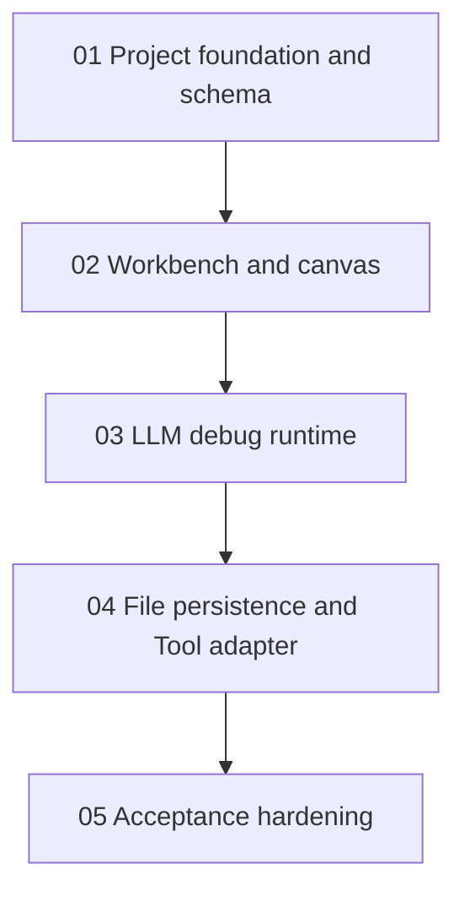

# AI Agent Workflow MVP Task Chain

Source spec: `docs/superpowers/specs/2026-05-30-ai-agent-workflow-mvp-design.md`

## Goal

Implement the MVP as a local Electron + React + TypeScript workbench for developers, with LLM node debugging as the first complete workflow. The finished MVP lets a user create or open a `.agentflow.json`, inspect a Dify/Coze-style workbench, configure and run an LLM node against an OpenAI-compatible endpoint, run one built-in Tool adapter, and save/reopen the workflow.

## Task Order

1. `01-project-foundation-and-schema.md`
2. `02-workbench-and-canvas.md`
3. `03-llm-debug-runtime.md`
4. `04-file-persistence-and-tool-adapter.md`
5. `05-acceptance-hardening.md`

## Dependency Graph

## Completion Definition

The chain is complete when every task handoff document has `Status: Complete`, every acceptance document has `Status: Accepted`, and the final task confirms the MVP acceptance criteria from the source spec.

## Handoff Rules

Each implementer updates only that task's handoff document after implementation. Downstream tasks must rely on the upstream task brief and handoff documents, not chat history.

## Acceptance Rules

Each reviewer follows the matching acceptance document. Acceptance results should record command output summaries, manual review notes, reviewer name, and date.

