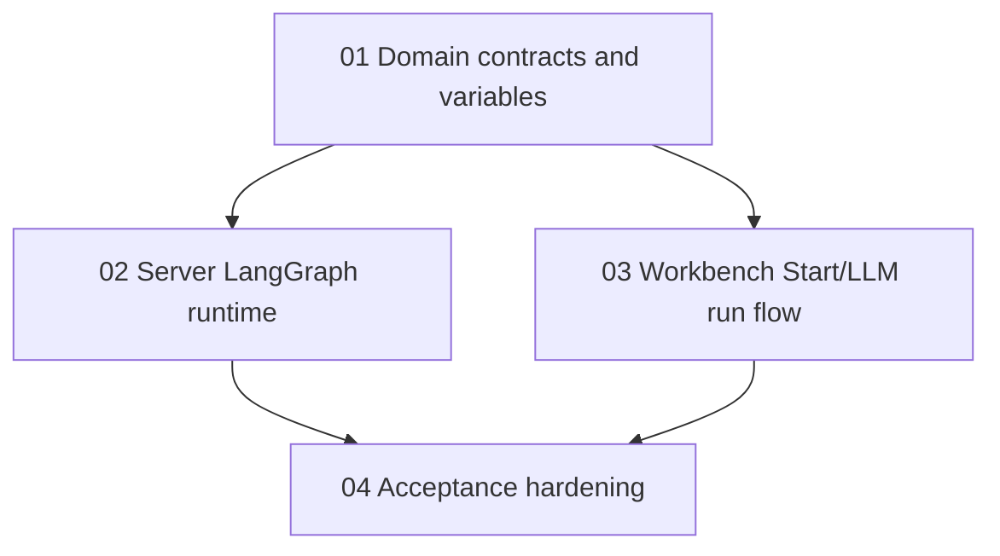

# LangGraph User Input And LLM Runtime Task Chain

Source spec: `docs/superpowers/specs/2026-06-01-langgraph-user-input-llm-design.md`

## Goal

Implement the first real workflow runtime path: a single `Start` node declares text inputs, LLM prompts consume namespaced variables, and `apps/server` compiles the supported workflow subset into LangGraph JS.

## Task Order

1. `01-domain-contracts-and-variables.md`
2. `02-server-langgraph-runtime.md`
3. `03-workbench-start-llm-run-flow.md`
4. `04-acceptance-hardening.md`

## Dependency Graph

## Completion Definition

The chain is complete when every task handoff document has `Status: Complete`, every acceptance document has `Status: Accepted`, the workbench can configure Start fields and run a full workflow, and the server executes supported workflows through LangGraph instead of mock run output.

## Handoff Rules

Each implementer updates only that task's handoff document after implementation. Downstream tasks must rely on the source spec, upstream task briefs, and upstream handoff documents, not chat history.

## Acceptance Rules

Each reviewer follows the matching acceptance document. Acceptance results should record command output summaries, manual review notes, reviewer name, and date.

## Chain-Level Non-Goals

- Do not implement file, image, audio, or multimodal Start inputs.
- Do not add mid-run human input, pause, resume, or interrupt behavior.
- Do not keep or add selected-node test execution.
- Do not implement Knowledge, Tool, Code, If/Else, Template, or End runtime semantics.
- Do not add durable run storage, auth, database persistence, queues, streaming, or hosted secret management.
